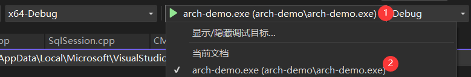

# 工程介绍

构建一个带路由功能的HTTP微服务架构，支持`JSON`序列化，支持`MySQL`关系型数据库，支持`JWT`安全认证，支持`Nacos`服务注册与配置管理，支持消息中间件`RocketMQ`，支持`FastDFS`分布式文件存储，支持`Redis`缓存数据库，支持`Excel`报表导入导出。

## 1 目录说明

- `arch-demo`：架构演示模块
- `arch-tests`：单元测试模块
- `lib-dy`：动态库存放目录
- `lib-common`：公用组件静态库模块
- `lib-oatpp`：web服务组件静态库模块
- `lib-mysql`：mysql数据库组件静态模块
- `nacos-register`：`Nacos`批量注册服务模块
- `.gitattributes`：git属性配置文件
- `.gitignore`：git忽略配置文件
- `build.sh`：Linux环境下构建和安装脚本
- `run-xxx.sh`：Linux环境下服务启动脚本
- `CMakeLists.txt`：`Cmake`配置
- `CMakeSettings.json`：VS `Cmake`项目配置文件
- `copy-resources.bat`：快速构建项目模块批处理脚本
- `exclude.txt`：批处理复制排除项配置
- `imgs`：自述文件图片资源目录
- `README.md`：工程自述文件

## 2 静态库目录规范

静态库项目包括如下几个主要的目录结构：

- `include`：存放第三方引入库的`h`或`hpp`文件，存放自己编写的`h`文件，方便使用静态库引用。
- `src`：存放`include`定义`h`的实现`cpp`资源文件。
- `lib / lib64`：用于存放第三方库编译的静态库。
- `pch.h / pch.cpp`：如果需要预编译标头，那么就需要定义。

## 3 动态库目录规范

动态库目录名称为`lib-dy`，里面主要包含程序执行需要的动态库文件，按照如下目录结构存放文件即可。

- `lib`
  - debug
  - release
- `lib64`
  - debug
  - release
  - Linux系统下面用到的动态库

## 4 环境搭建参考
静态库：

https://learn.microsoft.com/zh-cn/cpp/build/walkthrough-creating-and-using-a-static-library-cpp?view=msvc-170

标头：

https://learn.microsoft.com/zh-cn/cpp/build/walkthrough-header-units?view=msvc-170

**Linux：**

- https://learn.microsoft.com/zh-cn/cpp/linux/download-install-and-setup-the-linux-development-workload?view=msvc-170

- ```sh
  # CentOS、龙蜥
  yum -y install openssh-server gcc-c++ gdb cmake make ninja-build rsync zip unzip
  # Ubuntu
  sudo apt-get -y install openssh-server g++ gdb cmake make ninja-build rsync zip unzip
  ```

## 5 Windows平台项目搭建

克隆项目架构后，可以先使用`arch-demo`项目进行测试，用于确认项目架构能否正常工作。

在打开项目之前需要确保你的VS工作负荷支持`Cmake`，工作负荷示意如下图所示：


**TIP：** 

- 如果架构能够正常运行，接下来就需要在解决方案中，新增项目来完成你的业务功能。

- 你可以使用`copy-resources.bat`项目快速构建工具创建你项目模块。


### 5.1 配置项目模块

#### 5.1.1 创建项目模块

双击`copy-resources.bat`启动项目快速构建工具，然后输入你的模块名称，示例如下图所示：


执行成功后你可以看到一个项目模块目录，里面会包含项目骨架代码。

#### 5.1.2 修改项目配置

通过上一个步骤你已经将主要的项目骨架配置好了，接下来只需要做少量的修改就可以完成项目配置。

找到你的新增模块的`CMakeLists.txt`项目配置文件，将项目中的关于`demo项目的配置`去掉以及修改一下项目名即可。

关键配置如下所示：

```cmake
# CMakeList.txt: 【需要修改成你的项目名】 的 CMake 项目，在此处包括源代码并定义
# 项目特定的逻辑。
#
cmake_minimum_required (VERSION 3.8)

# 标记是否是示例架构模块，业务模块需要将此致修改为false
set(IS_ARCH_DEMO false) # 【将该变量值设置为false】

# 设置文件名称
set (appName 【需要修改成你的项目名】)

# 这里省略了一万行配置
```

#### 5.1.3 添加到解决方案中

要将你的项目模块添加到解决方案中非常简单，只需要修改项目根目录下面的`CMakeLists.txt`配置文件即可，在文件末尾追加上你的项目模块即可，关键配置如下所示

```cmake
# 这里省略了一万行配置

# 这是示例模块，后期可以不编译它
add_subdirectory ("arch-demo")
# 在后面添加你的模块
add_subdirectory ("你的模块对应的文件夹名")
```

#### 5.1.4 修改自述文件

每个项目模块都应该有对应的自述文件用来描述该模块的作用，你需要修改你的模块的`README.md`，来描述你的模块，下面是参考描述。

```markdown
# xxx模块

## 简介
这里是模块简介。

## 目录结构说明
> `你的模块文件夹名称`
>
> > `conf` -- Windows平台需要的配置文件
> >
> > `controller` -- `MVC`中Controller实现，用于接收用户请求
> >
> > `service` -- 业务逻辑服务层
> >
> > `dao` -- 数据库访问层
> >
> > `domain`  -- 领域模型实体
> >
> > `CMakeLists.txt` -- `Cmake`跨平台编译配置文件
> >
> > `Macros.h` -- 通用宏定义
> >
> > `ServerInfo.h` -- 服务器信息缓存单例
> >
> > `stdafx.h` -- 预编译标头文件
> >
> > `main.cpp` -- 程序入口
> >
> > `public.pem` -- `RSA`公钥
> >
> > `zh-dict.yaml` -- 中文词典配置

## 各层命名规范

- `Controller/Service/DAO` 层方法命名规约
  - 获取单个对象的方法用 `query/get/select` 做前缀。
  - 获取多个对象的方法用 `query/list/select` 做前缀。
  - 获取统计值的方法用 `count/count/count` 做前缀。
  - 插入的方法用 `add/save/insert` 做前缀。
  - 删除的方法用 `remove/remove/delete` 做前缀。
  - 修改的方法用 `modify/update/update` 做前缀。
  - `Controller`执行逻辑处理方法使用`exec`作前缀。
    - 如接口端点方法名称为`queryByName`，对应的执行方法名则为`execQueryByName`。
  - `API`请求路径命名，前缀（如：功能模块名称）+ 功能名称（多个单词使用-连接），比如下面的示例：
    - `/sys/query-by-name`、`/user/add-user`、`/user/modify-password`。
- 领域模型命名规约
  - DO：`xxxDO`，`xxx` 即为数据表名。
  - DTO：`xxxDTO`，`xxx` 为业务领域相关的名称。
  - Query：`xxxQuery`，`xxx`为业务领域相关的名称。
  - VO：`xxxVO`，`xxx` 一般为网页名称。
  - `POJO` 是 `DO/DTO/BO/VO/Query` 的统称，禁止命名成 `xxxPOJO`。
```

#### 5.1.5 修改中文词典编码

由于中文字典在构建的时候没有指定编码，为了避免中文乱码，所有需要修改其编码格式为`utf8`编码，修改方式有很多，下面演示使用VS高级保存选项功能来设置编码。

首先在你的项目模块中找到`zh-dict.yaml`文件，然后打开它，比如我打开后的效果如下图所示


然后找到你的**高级保存选项**菜单，点击的后，选择如下图所示的编码


修改成功后，再点开**高级保存选项**菜单后，看到的编码格式为


#### 5.1.6 启动测试

通过前面的步骤，你的新项目模块已经差不多配置好了，接下来可以启动测试，启动的时候选择新模块为启动项目，操作如下图所示。


选择完启动项后，点击项目启动，启动后可以看到如下图所示的效果，表示项目设置已经OK了


***提示：***可能启动会失败，此时应该是你的数据库地址、端口、账号、密码等等设置不匹配，修改`main.cpp`中对应代码或设置启动参数。

以上是构建新功能模块的基本操作步骤，是不是很简单就完成了~

#### 5.1.7 预编译头

在Windows环境下为加快程序编译效率，会启用预编译标头，下面是标头文件的定义，通过项目构建工具，会自动集成到你的模块中的。

```c++
// stdafx.h: 这是预编译标头文件。
// 下方列出的文件仅编译一次，提高了将来生成的生成性能。
// 这还将影响 IntelliSense 性能，包括代码完成和许多代码浏览功能。
// 但是，如果此处列出的文件中的任何一个在生成之间有更新，它们全部都将被重新编译。
// 请勿在此处添加要频繁更新的文件，这将使得性能优势无效。

#ifndef STDAFX_H
#define STDAFX_H

#ifndef LINUX

// 解决std::byte类型重定义
#define _HAS_STD_BYTE 0
// 添加要在此处预编译的标头
#include "OatppMacros.h"
#include "jwt/jwt.hpp"
#include "mysql/jdbc.h"
#include "SqlSession.h"
#include "yaml-cpp/yaml.h"
#include "sw/redis++/redis++.h"

#endif // !LINUX

#endif //STDAFX_H
```

下面是`stdafx.cpp`

```c++
// stdafx.cpp: 与预编译标头对应的源文件

#include "stdafx.h"

// 当使用预编译的头时，需要使用此源文件，编译才能成功。
```

**注意：你后面添加的每个`cpp`文件、`cpp`文件、`cpp`文件，导入的第一个头文件必须是标头文件`stdafx.h`，可以看项目骨架代码中的`cpp`文件中第一个导入的头文件是怎么写的。**

### 5.2 关键代码

#### 5.2.1 程序入口

在`main.cpp`中可以使用下列代码来启动服务器。

```c++
#include "stdafx.h"
#include "HttpServer.h"
#include "DbInit.h"

int main() {
    //初始数据库连接
    DbInit::initDbPool(
        DBConfig("root", "123456", "test", "192.168.220.128", 3306, 5));
    // 启动HTTP服务器
	HttpServer::startServer("8090",
		[=](Endpoints* doc, HttpRouter* router) {
			//设置路由，可以参考Router的实现
		});
	//释放数据库连接
	DbInit::releasePool();
	return 0;
}
```

#### 5.2.2 实现拦截器

在`lib-oatpp` 模块声明的拦截器（`SystemInterceptor.h`）需要在你的模块中定义。

```c++
#include "stdafx.h"
#include "SystemInterceptor.h"
using namespace oatpp::web::protocol::http;
using namespace oatpp::web::protocol::http::outgoing;
// 实现跨域请求拦截
std::shared_ptr<oatpp::web::server::interceptor::RequestInterceptor::OutgoingResponse> CrosRequestInterceptor::intercept(const std::shared_ptr<IncomingRequest>& request)
{
	return nullptr;
}
// 实现跨域响应拦截
std::shared_ptr<oatpp::web::server::interceptor::ResponseInterceptor::OutgoingResponse> CrosResponseInterceptor::intercept(const std::shared_ptr<IncomingRequest>& request, const std::shared_ptr<OutgoingResponse>& response)
{
	return response;
}
// 凭证检测拦截器构造初始化一些内容
CheckRequestInterceptor::CheckRequestInterceptor(const std::shared_ptr<oatpp::data::mapping::ObjectMapper>& objectMapper)
{
}
// 实现凭证检测拦截处理逻辑
std::shared_ptr<oatpp::web::server::interceptor::RequestInterceptor::OutgoingResponse> CheckRequestInterceptor::intercept(const std::shared_ptr<IncomingRequest>& request)
{
	return nullptr;
}
```

***TIP:完整的拦截器定义可以参考demo中实现，其中实现了凭证验证与跨域处理功能，可以直接复用。***

#### 5.2.3 使用启动参数

定义一个服务器信息类，用于存储服务器信息，参考代码如下

```cpp
class ServerInfo
{
private:
	// 成员初始化
	void init() {
		this->dbPort = 3306;
		this->dbMax = 25;
		// 加载中文词典
		zhDictNode = YAML::LoadFile("zh-dict.yaml");
	}
	// 定义单例
	DECLARE_INSTANCE(ServerInfo);
	// 服务器端口
	CC_SYNTHESIZE(std::string, serverPort, ServerPort);
	// Nacos配置参数
	CC_SYNTHESIZE(std::string, nacosAddr, NacosAddr);
	CC_SYNTHESIZE(std::string, nacosNs, NacosNs);
	CC_SYNTHESIZE(std::string, regIp, RegIp);
	CC_SYNTHESIZE(std::string, serviceName, ServiceName);
	// 数据库连接信息
	CC_SYNTHESIZE(std::string, dbUsername, DbUsername);
	CC_SYNTHESIZE(std::string, dbPassword, DbPassword);
	CC_SYNTHESIZE(std::string, dbName, DbName);
	CC_SYNTHESIZE(std::string, dbHost, DbHost);
	CC_SYNTHESIZE(int, dbPort, DbPort);
	CC_SYNTHESIZE(int, dbMax, DbMax);
	// 定义一个中文字典缓存
	CC_SYNTHESIZE_CR_GET(YAML::Node, zhDictNode, ZhDictNode);
};
```

通过启动参数设定服务器，方便部署服务器。

```c++
#include "stdafx.h"
#include "StringUtil.h"
#include "ServerInfo.h"
#include "HttpServer.h"
#include "controller/Router.h"
#include "DbInit.h"

/**
 * 解析启动参数
 * 注意：
 * 参数中数据需要满足一定的格式，如：sp=8090、sn=feign-cpp-sample
 * 前缀与真实值之间使用=分隔
 */
bool getStartArg(int argc, char* argv[]) {
	// 服务器端口
	std::string serverPort = "8090";
	// 数据库连接信息
	std::string dbUsername = "root";
	std::string dbPassword = "123456";
	std::string dbName = "test";
	std::string dbHost = "192.168.220.128";
	int dbPort = 3306;
	int dbMax = 25;
    
	// 开始解析
	int currIndex = 1;
	bool isSetDb = false;
	while (currIndex < argc)
	{
		// 拆分字符串
		auto args = StringUtil::split(argv[currIndex], "=");
		// 判断参数是否合法
		if (args.size() != 2) {
			cout << "arg: " << argv[currIndex] << ", format error." << endl;
			exit(1);
		}

		// 根据参数前缀对不同属性赋值
		std::string prefix = args[0];
		std::string val = args[1];
		if (prefix == "sp") serverPort = val;
		else if (prefix == "du") {
			isSetDb = true;
			dbUsername = val;
		}
		else if (prefix == "dp") {
			isSetDb = true;
			dbPassword = val;
		}
		else if (prefix == "dn") {
			isSetDb = true;
			dbName = val;
		}
		else if (prefix == "dh") {
			isSetDb = true;
			dbHost = val;
		}
		else if (prefix == "dP") {
			isSetDb = true;
			dbPort = atoi(val.c_str());
		}
		else if (prefix == "dm") dbMax = atoi(val.c_str());
		// 更新索引
		currIndex++;
	}

	// 记录服务器配置到内存中方便使用
	ServerInfo::getInstance().setServerPort(serverPort);
	ServerInfo::getInstance().setDbUsername(dbUsername);
	ServerInfo::getInstance().setDbPassword(dbPassword);
	ServerInfo::getInstance().setDbName(dbName);
	ServerInfo::getInstance().setDbHost(dbHost);
	ServerInfo::getInstance().setDbPort(dbPort);
	ServerInfo::getInstance().setDbMax(dbMax);
	return isSetDb;
}

int main(int argc, char* argv[]) {
	// 服务器参数初始化
	bool isSetDb = getStartArg(argc, argv);
	// 初始数据库连接
	DbInit::initDbPool(DBConfig(
		ServerInfo::getInstance().getDbUsername(), 
		ServerInfo::getInstance().getDbPassword(), 
		ServerInfo::getInstance().getDbName(),
		ServerInfo::getInstance().getDbHost(),
		ServerInfo::getInstance().getDbPort(), 
		ServerInfo::getInstance().getDbMax()));
	// 启动HTTP服务器
	HttpServer::startServer(ServerInfo::getInstance().getServerPort(),
		[=](Endpoints* doc, HttpRouter* router) {
			Router(doc, router).initRouter();
		});
	// 释放数据库连接
	DbInit::releasePool();
	return 0;
}
```

所有启动参数说明：

```sh
"na: nacos server host and port. example na=39.99.114.126:8848"
"ns: nacos server namespace. example ns=1653f775-4782-46ad-9cd2-b60155a574c6"
"ip: register ip. example ip=192.168.220.128"
"sn: register service name. example sn=feign-cpp-sample"
"sp: server port. example sp=8090"
"du: mysql database username. example du=root"
"dp: mysql database password. example dp=123456"
"dn: mysql database dbname. example dn=test"
"dh: mysql database host. example dh=192.168.220.128"
"dP: mysql database port. example dP=3306"
"dm: mysql database pool maxsize. example dm=25"
```

***注意：如果不在启动参中传入 `ip` 和 `sn`，服务器启动后就不会注册到 `Nacos` 注册中心，具体看后面的`Nacos`部分***

#### 5.2.4 `Cmake`设置启动参

首先选择启动项



打开启动项配置设置


在`lunch.vs.json`中加入你的启动参数配置，如


## 6 Linux平台项目搭建

### 6.1 参考链接

#### 6.1.1 `VS CMake`

VS中使用`CMake`参考下面的链接：

https://learn.microsoft.com/zh-cn/cpp/build/cmake-projects-in-visual-studio?view=msvc-170

除了完成 **小节4** 中Linux配置外，为了保证在编译时正常链接程序所需要的库，需要补充安装下列软件包：

```sh
# CentOS、龙蜥
yum -y install openssl-devel libcurl-devel libuuid-devel
# Ubuntu
sudo apt-get -y install openssl libssl-dev libcurl4-openssl-dev uuid-dev
```

#### 6.1.2 `openssl`版本升级

当你启动编译后的可执行文件出现下面的错误，出现这个问题一般是在`CentOS7`上面

```sh
./arch-demo: error while loading shared libraries: libssl.so.1.1: cannot open shared object file: No such file or directory
```

可以参考这个链接进行修复：https://blog.csdn.net/estelle_belle/article/details/111181037

### 6.2 编译配置

#### 6.2.1 项目模块

因为`Cmke`本身支持跨平台编译，而且我提供的`CMakeLists.txt`已经做了跨平台编译处理，所以一般不需要大家做特殊配置，下面是完整的模块项目配置参考。

```cmake
# CMakeList.txt: 【修改成你的模块名】 的 CMake 项目，在此处包括源代码并定义
# 项目特定的逻辑。
#
cmake_minimum_required (VERSION 3.8)

# 标记是否是示例架构模块，业务模块需要将此致修改为false
set(IS_ARCH_DEMO false)

# 设置文件名称
set (appName 【修改成你的模块名】)

# 包含库目录
include_directories ("./")
include_directories ("../lib-oatpp/include")
include_directories ("../lib-mysql/include")
include_directories ("../lib-common/include")

# 链接库路径，程序运行的时候也在这里找
link_directories (${PROJECT_BINARY_DIR}/lib-oatpp)
link_directories (${PROJECT_BINARY_DIR}/lib-mysql)
link_directories (${PROJECT_BINARY_DIR}/lib-common)
# 如果是Linux环境
if(UNIX)
	link_directories (${PROJECT_SOURCE_DIR}/lib-common/lib64)
	link_directories (${PROJECT_SOURCE_DIR}/lib-oatpp/lib64)
	link_directories (${PROJECT_SOURCE_DIR}/lib-dy/lib64)
# 如果是Windows环境
elseif(WIN32)
	link_directories (${PROJECT_SOURCE_DIR}/lib-common/${ZO_LB_NAME}/${ZO_LBT_NAME})
	link_directories (${PROJECT_SOURCE_DIR}/lib-oatpp/${ZO_LB_NAME}/openssl)
	link_directories (${PROJECT_SOURCE_DIR}/lib-oatpp/${ZO_LB_NAME}/${ZO_LBT_NAME})
	link_directories (${PROJECT_SOURCE_DIR}/lib-mysql/${ZO_LB_NAME}/vs14/${ZO_LBT_NAME})
endif()

# 获取要编译的源代码
file (GLOB_RECURSE SC_FILES ./*.cpp)
list (REMOVE_ITEM SC_FILES "${CMAKE_CURRENT_SOURCE_DIR}/./stdafx.cpp")

# 设置预编译标头
if(WIN32)
	ADD_MSVC_PRECOMPILED_HEADER("stdafx.h" "stdafx.cpp" SC_FILES)
endif()

# 编译可执行文件
add_executable (${appName} ${SC_FILES})

# 给架构示例项目添加特有的宏
if(${IS_ARCH_DEMO})
	target_compile_definitions(${appName} PRIVATE HTTP_SERVER_DEMO)
endif()

# 链接自定义静态库模块
target_link_libraries (${appName} "lib-common" "lib-oatpp" "lib-mysql")

# 链接其他库依赖库，如：你要链接libpthread直接写成pthread
if (UNIX)
	target_link_libraries (${appName} jsoncpp pthread stdc++fs OpenSSL::SSL CURL::libcurl)
else()
	target_link_libraries (${appName} libcrypto libssl ws2_32)
endif()
target_link_libraries (${appName} oatpp-websocket oatpp-swagger oatpp )
target_link_libraries (${appName} mysqlcppconn )
# 链接xlnt
if(USE_XLNT)
	if(ZO_BT STREQUAL "r" OR UNIX)
		target_link_libraries (${appName} xlnt )
	else()
		target_link_libraries (${appName} xlntd )
	endif()
	message (STATUS "${appName}: link xlnt lib")
endif()
# 链接fastdfs
if(USE_DFS)
	if (UNIX)
		target_link_libraries (${appName} fdfsclient fastcommon )
	endif()
	message (STATUS "${appName}: link fdfsclient lib")
endif()
# 链接ymal
if(USE_YML)
	if(ZO_BT STREQUAL "r" OR UNIX)
		target_link_libraries (${appName} yaml-cpp )
	else()
		target_link_libraries (${appName} yaml-cppd )
	endif()
	message (STATUS "${appName}: link yamlcpp lib")
endif()
# 链接nacos
if(USE_NACOS)
	if (UNIX)
		target_link_libraries (${appName} nacos-cli )
	endif()
	message (STATUS "${appName}: link nacos lib")
endif()
# 链接redis
if(USE_REDIS)
	target_link_libraries (${appName} redis++ hiredis )
	message (STATUS "${appName}: link redis lib")
endif()
# 链接RocketMQ
if(USE_ROCKETMQ)
	if (WIN32)
		target_link_libraries (${appName} rocketmq-client-cpp )
	else()
		target_link_libraries (${appName} rocketmq )
	endif()
	message (STATUS "${appName}: link rocketmq lib")
endif()
# 链接MongoDB
if(USE_MONGO)
	if (WIN32)
		target_link_libraries (${appName} bsoncxx mongocxx )
	else()
		target_link_libraries (${appName} bsoncxx bson-1.0 mongocxx mongoc-1.0 )
	endif()
	message (STATUS "${appName}: link mongodb lib")
endif()
# 链接AliyunSms
if(USE_ALISMS)
	if (UNIX)
		target_link_libraries (${appName} alibabacloud-sdk-core alibabacloud-sdk-dysmsapi )
	endif()
	message (STATUS "${appName}: link aliyun sms lib")
endif()
# 链接PDF库
if(USE_PDF)
	if (UNIX)
		target_link_libraries (${appName} hpdf png16 z ZXing)
	else()
		target_link_libraries (${appName} hpdf ZXing)
		if(ZO_BT STREQUAL "r")
			target_link_libraries (${appName} libpng16 )
		else()
			target_link_libraries (${appName} libpng16d )
		endif()
	endif()
	message (STATUS "${appName}: link hpdf lib")
endif()

# 复制配置到调试时可执行文件所在的目录
# public目录
if(${IS_ARCH_DEMO})
	file (GLOB publicDir "public/*")
	file (COPY ${publicDir} DESTINATION "${PROJECT_BINARY_DIR}/${appName}/public")
endif()
# RSA公钥证书
file (COPY "public.pem" DESTINATION ${PROJECT_BINARY_DIR}/${appName})
# Swagger资源
file (GLOB swaggerRes "../lib-oatpp/include/oatpp-swagger/res/*")
file (COPY ${swaggerRes} DESTINATION ${PROJECT_BINARY_DIR}/${appName}/res)
# 中文词典
file (COPY "zh-dict.yaml" DESTINATION ${PROJECT_BINARY_DIR}/${appName})
# 模板文件目录
file (GLOB tplDir "tpl/*")
file (COPY ${tplDir} DESTINATION "${PROJECT_BINARY_DIR}/${appName}/tpl")
# Ubuntu系统特殊处理
if(IS_UBUNTU)
	# 复制动态库到可执行文件目录
	file (GLOB dylibdir "${PROJECT_SOURCE_DIR}/lib-dy/lib64/*")
    file (COPY ${dylibdir} DESTINATION "${PROJECT_BINARY_DIR}/${appName}")
endif()
# Windows平台特殊处理
if(WIN32)
	# 复制dll文件到可执行文件目录
	file (GLOB_RECURSE dycopy ${ZO_DY_DIR}/*.dll)
	file (COPY ${dycopy} DESTINATION "${PROJECT_BINARY_DIR}/${appName}")
	# 复制项目配置到可执行文件目录
	file (GLOB conf "conf/*")
	file (COPY ${conf} DESTINATION ${PROJECT_BINARY_DIR}/${appName}/conf)
endif()

# 安装文件
# public目录
if(${IS_ARCH_DEMO})
	install (DIRECTORY "public" DESTINATION ${appName})
endif()
# 可执行文件
install (TARGETS ${appName} RUNTIME DESTINATION ${appName})
# RSA公钥证书
install (FILES "public.pem" DESTINATION ${appName})
# Swagger资源
install (DIRECTORY "${PROJECT_SOURCE_DIR}/lib-oatpp/include/oatpp-swagger/res" DESTINATION ${appName})
# 中文词典
install (FILES "zh-dict.yaml" DESTINATION ${appName})
# 模板文件目录
install (DIRECTORY "tpl" DESTINATION ${appName})
# UNIX平台特殊处理
if(UNIX)
	# 复制第三方动态链接库
	install (DIRECTORY "${PROJECT_SOURCE_DIR}/lib-dy/lib64/" DESTINATION lib FILES_MATCHING PATTERN "*.so*")
	# 复制启动脚本
	install (PROGRAMS ${PROJECT_SOURCE_DIR}/run-front.sh ${PROJECT_SOURCE_DIR}/run-back.sh DESTINATION ${appName})
endif()
# Windows平台特殊处理
if(WIN32)
	# 复制dll文件到可执行文件目录
	install (DIRECTORY "${ZO_DY_DIR}/" DESTINATION ${appName} FILES_MATCHING PATTERN "*.dll")
	# 复制项目配置到可执行文件目录
	install (DIRECTORY "conf" DESTINATION ${appName})
endif()
```

#### 6.2.2 全局配置

除此之外，还需要修改解决方案中的`CMakeLists.txt`，包含你的项目模块目录，参考如下：

```cmake
# CMakeList.txt: 顶层 CMake 项目文件，在此处执行全局配置
# 并包含子项目。
#
cmake_minimum_required (VERSION 3.8)

# 【需要修改】：指定工程名
project ("")

# 设置安装目录前缀
if(NOT WIN32)
	set (CMAKE_INSTALL_PREFIX "../install/${PROJECT_NAME}" CACHE PATH "install path prefix" FORCE )
endif()

# C++标准
set (CMAKE_CXX_STANDARD 17)
set (CMAKE_CXX_STANDARD_REQUIRED ON)

# 判断构建类型
if ((NOT CMAKE_BUILD_TYPE) 
	OR (CMAKE_BUILD_TYPE STREQUAL "") 
	OR (CMAKE_BUILD_TYPE STREQUAL "Release")
	OR (CMAKE_BUILD_TYPE STREQUAL "RelWithDebInfo"))
	set (ZO_BT "r")
else()
	set (ZO_BT "d")
endif()

# 根据平台设置一些变量名
if (CMAKE_SIZEOF_VOID_P EQUAL 8)
	message (STATUS "Platform is x64")
	set(ZO_LB_NAME "lib64")
else()
	message (STATUS "Platform is x86")
	set(ZO_LB_NAME "lib")
endif()
if(ZO_BT STREQUAL "r")
	message (STATUS "Build type is RELEASE")
	set(ZO_LBT_NAME "")
	set(ZO_DY_DIR ${PROJECT_SOURCE_DIR}/lib-dy/${ZO_LB_NAME}/release)
else()
	message (STATUS "Build type is DEBUG")
	set(ZO_LBT_NAME "debug")
	set(ZO_DY_DIR ${PROJECT_SOURCE_DIR}/lib-dy/${ZO_LB_NAME}/debug)
endif()

# 添加公用宏定义
if (ZO_BT STREQUAL "r")
	add_definitions(-DOATPP_DISABLE_ENV_OBJECT_COUNTERS)
endif()
if (UNIX)
	add_definitions(-D_CRT_SECURE_NO_WARNINGS -D_SILENCE_ALL_CXX17_DEPRECATION_WARNINGS)
	add_definitions(-DCPP_JWT_USE_VENDORED_NLOHMANN_JSON)
	add_definitions(-DLINUX)
	add_definitions(-DCHECK_TOKEN)
	add_definitions(-DSTOP_PWD="01star")
	add_definitions(-DOATPP_SWAGGER_SERVICE_NAME="${PROJECT_NAME} for linux")
	add_definitions(-DOATPP_SWAGGER_RES_PATH="res")
	add_definitions(-DBSONCXX_STATIC -DMONGOCXX_STATIC -DENABLE_AUTOMATIC_INIT_AND_CLEANUP=OFF)
else()
	add_definitions(-DOATPP_SWAGGER_SERVICE_NAME="${PROJECT_NAME} for windows")
	add_definitions(-DOATPP_SWAGGER_RES_PATH="res")
endif()

# 在camke .. 的时候会输出提示目录路径
message (STATUS "Prefix dir is ${CMAKE_INSTALL_PREFIX}")
message (STATUS "Binary dir is ${PROJECT_BINARY_DIR}")
message (STATUS "Source dir is ${PROJECT_SOURCE_DIR}")

# 判断是否是Ubuntu系统
option (IS_UBUNTU "is ubuntu" OFF)
cmake_host_system_information(RESULT PRETTY_NAME QUERY OS_VERSION)
if (${PRETTY_NAME} MATCHES "Ubuntu")
	option (IS_UBUNTU "is ubuntu" ON)
endif()

# Liunx环境库依赖检查
if (NOT WIN32)
	# 检查OpenSSL库是否存在
	find_package (OpenSSL REQUIRED)
	if (OPENSSL_FOUND)
	  include_directories (${OPENSSL_INCLUDE_DIRS})
	  message (STATUS "OpenSSL Found!")
	endif()
	# 检查CURL库是否存在
	find_package (CURL REQUIRED)
	if (CURL_FOUND)
	  include_directories (${CURL_INCLUDE_DIRS})
	  message (STATUS "CURL Found!")
	endif()
endif()

# 设置选项开关
option (USE_XLNT "use xlnt" ON)
option (USE_DFS "use fastdfs" ON)
option (USE_YML "use yaml" ON)
if (NOT WIN32)
	option (USE_NACOS "use nacos, need open yaml" ON)
endif()
option (USE_REDIS "use redis" ON)
option (USE_ROCKETMQ "use rocketmq" ON)
option (USE_MONGO "use mongodb" ON)
if (NOT WIN32)
	option (USE_ALISMS "use aliyun sms" ON)
endif()
option (USE_PDF "use libharu pdf" ON)

# 选项宏定义
# 为了保证排除后编译通过，在单独使用这些库的地方加上对应的宏定义
if (USE_XLNT)
	add_definitions(-DUSE_XLNT)
endif()
if (USE_DFS)
	add_definitions(-DUSE_DFS)
endif()
if (USE_YML)
	add_definitions(-DUSE_YML)
endif()
if (USE_NACOS)
	add_definitions(-DUSE_NACOS)
endif()
if (USE_REDIS)
	add_definitions(-DUSE_REDIS)
endif()
if (USE_ROCKETMQ)
	add_definitions(-DUSE_ROCKETMQ)
endif()
if (USE_MONGO)
	add_definitions(-DUSE_MONGO)
endif()
if (USE_ALISMS)
	add_definitions(-DUSE_ALISMS)
endif()
if (USE_PDF)
	add_definitions(-DUSE_PDF)
endif()

# 定义一个预编译标头宏
MACRO(ADD_MSVC_PRECOMPILED_HEADER PrecompiledHeader PrecompiledSource SourcesVar)
  IF(MSVC)
    GET_FILENAME_COMPONENT(PrecompiledBasename ${PrecompiledHeader} NAME_WE)
    SET(PrecompiledBinary "${CMAKE_CURRENT_BINARY_DIR}/${PrecompiledBasename}.pch")
    SET(Sources ${${SourcesVar}})
    SET_SOURCE_FILES_PROPERTIES(${PrecompiledSource}
                                PROPERTIES COMPILE_FLAGS "/Yc\"${PrecompiledHeader}\" /Fp\"${PrecompiledBinary}\""
                                           OBJECT_OUTPUTS "${PrecompiledBinary}")
    SET_SOURCE_FILES_PROPERTIES(${Sources}
                                PROPERTIES COMPILE_FLAGS "/Yu\"${PrecompiledHeader}\" /FI\"${PrecompiledHeader}\" /Fp\"${PrecompiledBinary}\""
                                           OBJECT_DEPENDS "${PrecompiledBinary}") 
    LIST(APPEND ${SourcesVar} ${PrecompiledSource})
  ENDIF(MSVC)
ENDMACRO(ADD_MSVC_PRECOMPILED_HEADER)

# 包含子项目
add_subdirectory ("lib-oatpp")
add_subdirectory ("lib-mysql")
add_subdirectory ("lib-common")
if(UNIX)
	add_subdirectory ("nacos-register")
endif()
# 单元测试模块
if(DEFINED UNIT_TEST)
	add_subdirectory ("arch-tests")
endif()
# 【需要修改】：在后面添加你的模块
```

#### 6.2.3 `VS Cmake`配置参考

需要忽略不需要复制到Linux服务器的文件，下面是参考配置。

```json
{
  "configurations": [
    {
      "name": "x64-Debug",
      "generator": "Ninja",
      "configurationType": "Debug",
      "buildRoot": "${projectDir}\\out\\build\\${name}",
      "installRoot": "${projectDir}\\out\\install\\${name}",
      "cmakeCommandArgs": "-DUNIT_TEST=1",
      "buildCommandArgs": "",
      "ctestCommandArgs": "",
      "inheritEnvironments": [ "msvc_x64_x64" ]
    },
    {
      "name": "x64-Release",
      "generator": "Ninja",
      "configurationType": "RelWithDebInfo",
      "buildRoot": "${projectDir}\\out\\build\\${name}",
      "installRoot": "${projectDir}\\out\\install\\${name}",
      "cmakeCommandArgs": "",
      "buildCommandArgs": "",
      "ctestCommandArgs": "",
      "inheritEnvironments": [ "msvc_x64_x64" ]
    },
    {
      "name": "Linux-GCC-Debug",
      "generator": "Ninja",
      "configurationType": "Debug",
      "cmakeExecutable": "cmake",
      "remoteCopySourcesExclusionList": [ ".vs", ".git", "out", "[Dd]ebug", "[Rr]elease", "x64", "imgs", "*.lib", "*.dll", "*.vcxproj*", "*.md", "*.sln", "*.bat" ],
      "cmakeCommandArgs": "-DUNIT_TEST=1",
      "buildCommandArgs": "",
      "ctestCommandArgs": "",
      "inheritEnvironments": [ "linux_x64" ],
      "remoteMachineName": "${defaultRemoteMachineName}",
      "remoteCMakeListsRoot": "$HOME/.vs/${projectDirName}/${workspaceHash}/src",
      "remoteBuildRoot": "$HOME/.vs/${projectDirName}/${workspaceHash}/out/build/${name}",
      "remoteInstallRoot": "$HOME/.vs/${projectDirName}/${workspaceHash}/out/install/${name}",
      "remoteCopySources": true,
      "rsyncCommandArgs": "-t --delete --delete-excluded",
      "remoteCopyBuildOutput": false,
      "remoteCopySourcesMethod": "rsync"
    },
    {
      "name": "Linux-GCC-Release",
      "generator": "Ninja",
      "configurationType": "RelWithDebInfo",
      "cmakeExecutable": "cmake",
      "remoteCopySourcesExclusionList": [ ".vs", ".git", "out", "[Dd]ebug", "[Rr]elease", "x64", "imgs", "*.lib", "*.dll", "*.vcxproj*", "*.md", "*.sln", "*.bat" ],
      "cmakeCommandArgs": "",
      "buildCommandArgs": "",
      "ctestCommandArgs": "",
      "inheritEnvironments": [ "linux_x64" ],
      "remoteMachineName": "${defaultRemoteMachineName}",
      "remoteCMakeListsRoot": "$HOME/.vs/${projectDirName}/${workspaceHash}/src",
      "remoteBuildRoot": "$HOME/.vs/${projectDirName}/${workspaceHash}/out/build/${name}",
      "remoteInstallRoot": "$HOME/.vs/${projectDirName}/${workspaceHash}/out/install/${name}",
      "remoteCopySources": true,
      "rsyncCommandArgs": "-t --delete",
      "remoteCopyBuildOutput": false,
      "remoteCopySourcesMethod": "rsync"
    }
  ]
}
```

### 6.3 启动与停止服务

前台启动指令参考

```sh
./arch-demo sp=8091 du=root ...
# 其中...表示其它启动参数配置，根据你的需要增加即可
```

后台启动指令参考

```sh
nohup ./arch-demo sp=8091 du=root ... >logs.log 2>&1 &
# 其中...表示其它启动参数配置，根据你的需要增加即可
```

停止服务参考指令

```sh
curl http://ip:port/system-kill/密码
# 如: curl http://127.0.0.1:8091/system-kill/01star
```

**TIP**：

*启动如果提示找不到相应的动态库，请将可执行文件同级目录下面的 `lib64` 目录下面的所有 `.so` 文件上传到目标服务器的 `/usr/lib64` 目录下面。*

使用`make install`指令安装后的可执行文件，可以使用shell脚本启动服务，下面是使用示例。

```sh
# 前台启动
./run-front.sh arch-demo sp=8090 du=root ...
# 后台启动
./run-back.sh arch-demo sp=8090 du=root ...
```

### 6.4 支持`Nacos`服务注册与配置获取

#### 6.4.1 编译配置

```cmake
# 保证你的编译配置中包含有nacos-cli和yaml-cpp
target_link_libraries (${appName} nacos-cli yaml-cpp )
```

#### 6.4.2 程序入口修改

```cpp
#include "stdafx.h"
#include "StringUtil.h"
#include "ServerInfo.h"
#include "HttpServer.h"
#include "controller/Router.h"
#include "controller/OtherComponent.hpp"
#include "DbInit.h"
#ifdef LINUX
#include "NacosClient.h"
#endif

// 是否是发布Swagger文档包
#ifndef _RELEASE_DOC_
// 查看Swagger文档的时候不需要连接数据库，解开下面的注释关闭启动连接数据库
//#define _RELEASE_DOC_
#endif

/**
 * 解析启动参数
 * 注意：
 * 参数中数据需要满足一定的格式，如：sp=8090、sn=feign-cpp-sample
 * 前缀与真实值之间使用=分隔
 */
bool getStartArg(int argc, char* argv[]) {
	// 服务器端口
	std::string serverPort = "8090";
	// 数据库连接信息
	std::string dbUsername = "root";
	std::string dbPassword = "123456";
	std::string dbName = "test";
	std::string dbHost = "192.168.220.128";
	int dbPort = 3306;
	int dbMax = 5;
#ifdef LINUX
	// Nacos配置参数
	std::string nacosAddr = "192.168.220.128:8848";
	std::string nacosNs = "4833404f-4b82-462e-889a-3c508160c6b4";
	std::string serviceName = "";
	std::string regIp = "";
#endif

	// 开始解析
	int currIndex = 1;
	bool isSetDb = false;
	while (currIndex < argc)
	{
		// 拆分字符串
		auto args = StringUtil::split(argv[currIndex], "=");
		// 判断参数是否合法
		if (args.size() != 2)
		{
			cout << "arg: " << argv[currIndex] << ", format error." << endl;
			exit(1);
		}

		// 根据参数前缀对不同属性赋值
		std::string prefix = args[0];
		std::string val = args[1];
		if (prefix == "sp") serverPort = val;
		else if (prefix == "du")
		{
			isSetDb = true;
			dbUsername = val;
		}
		else if (prefix == "dp")
		{
			isSetDb = true;
			dbPassword = val;
		}
		else if (prefix == "dn")
		{
			isSetDb = true;
			dbName = val;
		}
		else if (prefix == "dh")
		{
			isSetDb = true;
			dbHost = val;
		}
		else if (prefix == "dP")
		{
			isSetDb = true;
			dbPort = atoi(val.c_str());
		}
		else if (prefix == "dm") dbMax = atoi(val.c_str());
#ifdef LINUX
		else if (prefix == "na") nacosAddr = val;
		else if (prefix == "ns") nacosNs = val;
		else if (prefix == "sn") serviceName = val;
		else if (prefix == "ip") regIp = val;
#endif
		// 更新索引
		currIndex++;
	}

	// 记录服务器配置到内存中方便使用
	ServerInfo::getInstance().setServerPort(serverPort);
	ServerInfo::getInstance().setDbUsername(dbUsername);
	ServerInfo::getInstance().setDbPassword(dbPassword);
	ServerInfo::getInstance().setDbName(dbName);
	ServerInfo::getInstance().setDbHost(dbHost);
	ServerInfo::getInstance().setDbPort(dbPort);
	ServerInfo::getInstance().setDbMax(dbMax);
#ifdef LINUX
	ServerInfo::getInstance().setNacosAddr(nacosAddr);
	ServerInfo::getInstance().setNacosNs(nacosNs);
	ServerInfo::getInstance().setRegIp(regIp);
	ServerInfo::getInstance().setServiceName(serviceName);
#endif
	return isSetDb;
}

int main(int argc, char* argv[]) {
	// 服务器参数初始化
	bool isSetDb = getStartArg(argc, argv);

#ifdef LINUX
	// 创建Nacos客户端对象
	NacosClient nacosClient(
		ServerInfo::getInstance().getNacosAddr(),
		ServerInfo::getInstance().getNacosNs());
	// 从Nacos配置中心中获取数据库配置
	if (!isSetDb)
	{
		YAML::Node node = nacosClient.getConfig("data-source.yaml");
		YamlHelper yaml;
		std::string dbUrl = yaml.getString(&node, "spring.datasource.url");
		if (dbUrl != "")
		{
			int dbPort = 0;
			std::string dbHost = "";
			std::string dbName = "";
			// 解析数据库连接字符串
			yaml.parseDbConnUrl(dbUrl, &dbHost, &dbPort, &dbName);
			// 获取数据库用户名和密码
			std::string dbUsername = yaml.getString(&node, "spring.datasource.username");
			std::string dbPassword = yaml.getString(&node, "spring.datasource.password");
			// 重新修改缓存中的数据
			ServerInfo::getInstance().setDbUsername(dbUsername);
			ServerInfo::getInstance().setDbPassword(dbPassword);
			ServerInfo::getInstance().setDbName(dbName);
			ServerInfo::getInstance().setDbHost(dbHost);
			ServerInfo::getInstance().setDbPort(dbPort);
		}
	}

	// 注册服务
	if (!ServerInfo::getInstance().getServiceName().empty() && !ServerInfo::getInstance().getRegIp().empty())
	{
		nacosClient.registerInstance(
			ServerInfo::getInstance().getRegIp(),
			atoi(ServerInfo::getInstance().getServerPort().c_str()),
			ServerInfo::getInstance().getServiceName());
	}
#endif

#ifndef _RELEASE_DOC_
	// 初始数据库连接
	bool initConnPool = DbInit::initDbPool(DBConfig(
		ServerInfo::getInstance().getDbUsername(),
		ServerInfo::getInstance().getDbPassword(),
		ServerInfo::getInstance().getDbName(),
		ServerInfo::getInstance().getDbHost(),
		ServerInfo::getInstance().getDbPort(),
		ServerInfo::getInstance().getDbMax()));
	if (!initConnPool) return -1;
#endif

	// 启动HTTP服务器
	HttpServer::startServer(ServerInfo::getInstance().getServerPort(),
		[=](Endpoints* doc, HttpRouter* router) {
			Router(doc, router).initRouter();
		},
		[](std::shared_ptr<AbstractComponentReg>* o) {
			*o = std::make_shared<OtherComponent>();
		});

#ifndef _RELEASE_DOC_
	// 释放数据库连接
	DbInit::releasePool();
#endif

#ifdef LINUX
	// 反注册服务
	if (!ServerInfo::getInstance().getServiceName().empty() && !ServerInfo::getInstance().getRegIp().empty())
	{
		nacosClient.deregisterInstance(
			ServerInfo::getInstance().getRegIp(),
			atoi(ServerInfo::getInstance().getServerPort().c_str()),
			ServerInfo::getInstance().getServiceName());
	}
#endif
	return 0;
}

```

# 分层领域模型规约

领域模型本身有没固定的使用限制，但是在一套项目架构体系中需要有统一的规范。

领域对象描述：

- DO（Data Object）：此对象与数据库表结构一一对应，通过 `DAO` 层向上传输数据源对象。
- `DTO`（Data Transfer Object）：数据传输对象，Service 或 Manager 向外传输的对象。 
- BO（Business Object）：业务对象，可以由 Service 层输出的封装业务逻辑的对象。
- Query：数据查询对象，各层接收上层的查询请求。注意超过2个参数的查询封装，禁止使用Map类来传输。
- `VO`（View Object）：显示层对象，通常是 Web 向模板渲染引擎层传输的对象。

各层之间的关系如下图所示，里面包含了领域模型的传递过程。


